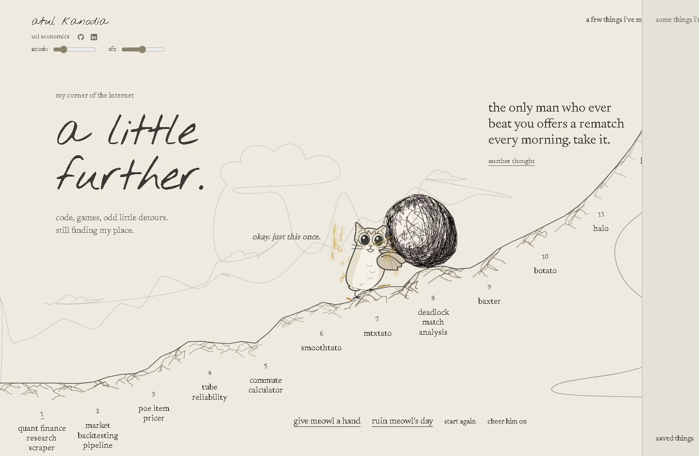
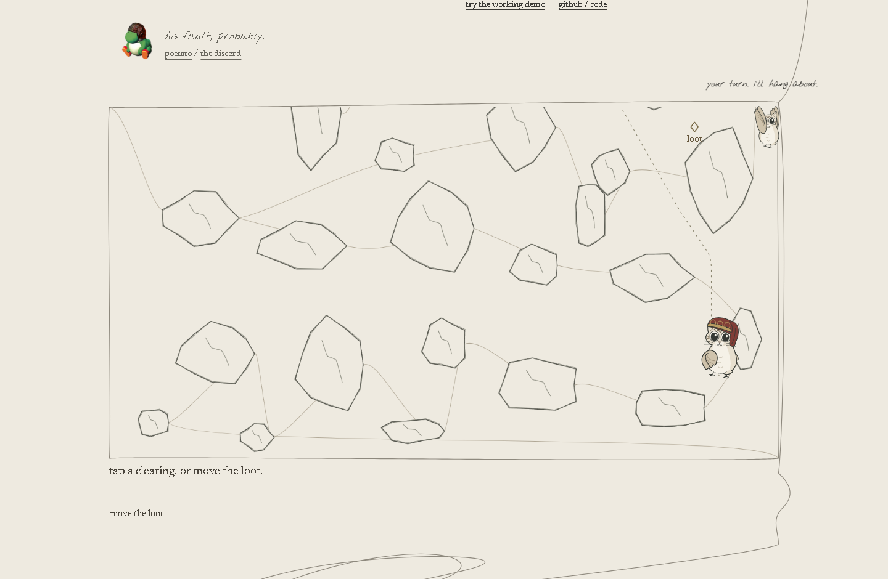

# my corner of the internet

A little meowl pushing a boulder, and twelve things I have been tinkering with, plus the other constants in my brain.

**[Visit the website](https://atul-kanodia-fieldnotes.atulswaggalicious.chatgpt.site)** · [All project repositories and demos](https://github.com/LolStar123)



## Run locally

```sh
npm ci
npm run check
python -m http.server 8000 --directory dist
```

Open http://localhost:8000. The checked-in static build works without a backend.
After editing an embedded project scene, run `npm run build:demos`.

## Find your way around

| Source | Responsibility |
| --- | --- |
| [dist/index.html](dist/index.html) | The page, twelve projects and the interests thought bubble |
| [dist/creations.js](dist/creations.js) | Project descriptions, GitHub links and working demos |
| [dist/hill-physics.js](dist/hill-physics.js) | Boulder, terrain erosion and the meowl's movement |
| [dist/little-creatures.js](dist/little-creatures.js) | Shared drawn characters and poses |
| [dist/pen-thread.js](dist/pen-thread.js) | The connected line through the page |
| [dist/mini-scenes.js](dist/mini-scenes.js) | Project scenes |
| [dist/soundscape.js](dist/soundscape.js) | Screen-aware sound and volume controls |
| [dist/credits.html](dist/credits.html) | Asset sources and attribution |

This repository contains the public website source, without local research notes,
hosting credentials or personal workspace history. Third-party artwork, sound and
fonts retain their respective rights; see the credits and bundled license files.

## Small experiments

- [OCR matching](examples/ocr_match.py): run `python examples/ocr_match.py`. Normalises confusable characters and checks exact/fuzzy modifier matches without screen capture or input automation.
- [Personal scenes](dist/personal-scenes.js): archived OCR example and an animated daydream bubble with readable interests.
- [Interaction system](dist/toy-interactions.js): precise picking and a shared [page-wide physics world](dist/page-toys.js) for throwing, collisions and winged recovery.
- [Guiding line](dist/thread-life.js): smooth elastic tugs and a [world-space guide](dist/guide-motion.js) with climbs, leaps, rail grinds and ledge hangs.
- [Design rules](DESIGN.md) and [reference decisions](docs/reference-notes.md).

Enter with three pushes to unlock audio. The examples run automatically while visible. Main music and effects have separate sliders. Project-panel themes are original quiet synth arrangements. The website remains a stylised playground; illustrative scene data is labelled separately from the linked working research demos.

## Interaction review

[Latest checklist and test findings](docs/guide-followup.md). The review includes real pointer throws, repeated hill impacts, mobile layout, panel switching and continuous movement during fast scrolling. It records both fixed failures and simulation limits.


