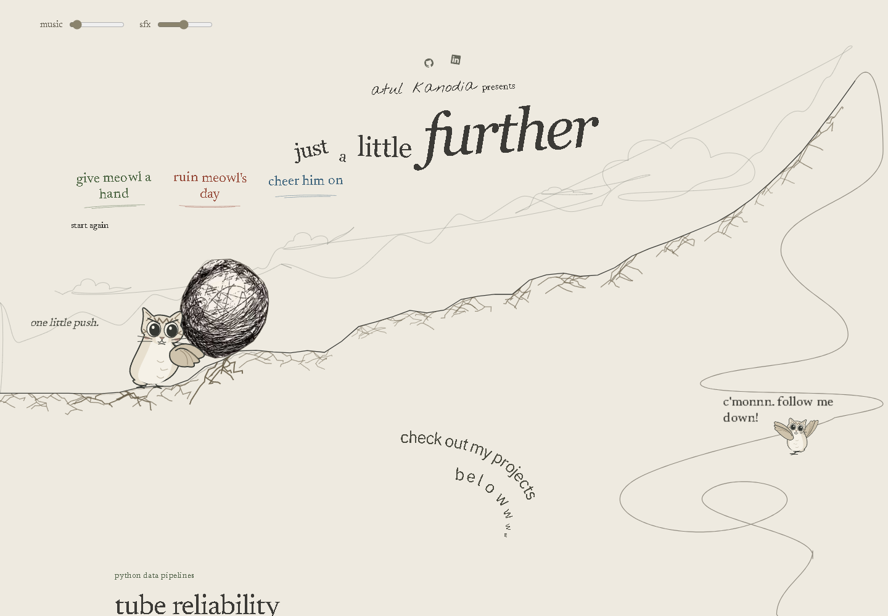

# just a little further

A meowl, a boulder and the things I made for games, trains and stubborn little questions.

**[Visit the website](https://lolstar123.github.io/just-a-little-further/)** · [The whole project shelf](https://github.com/LolStar123/LolStar123/blob/main/PROJECTS.md)



Give meowl three pushes to enter. Drag the boulder, cheer him on or ruin his day. One continuous pen line wanders from the hill through nine project stops and an interests bubble. The scenes play while you scroll; the linked demos are the working projects.

The shelf starts with Tube reliability and commute costs, then moves through quant research, PoE prices, Smoothtato, Deadlock analysis, Baxter, Botato, HALO and auction hardware. On a phone, a folded **a small jump to...** stays within the sketchbook so you can skip to a project without losing the hillside entrance.

## Run locally

From this repository:

```sh
npm ci
npm run check
python -m http.server 8000 --directory dist
```

Open http://localhost:8000. The checked-in static build works without a backend.

After editing an embedded scene, rebuild its bundle and cache key:

```sh
npm run build:demos
```

## Find the moving parts

| Source | Responsibility |
| --- | --- |
| [dist/index.html](dist/index.html) | Hill entrance, project stops, native phone navigation and footer |
| [dist/creations.js](dist/creations.js) | Project descriptions, public source links and demo scope |
| [dist/friend-review.css](dist/friend-review.css) | Final layout, reading hierarchy, controls and phone styles |
| [dist/small-jump.js](dist/small-jump.js) | Close the native jump list on selection or Escape, and move keyboard focus |
| [dist/hill-physics.js](dist/hill-physics.js) | Boulder, terrain erosion and meowl movement |
| [dist/little-creatures.js](dist/little-creatures.js) | Shared characters and poses |
| [dist/pen-thread.js](dist/pen-thread.js) | The connected line through the page |
| [dist/mini-scenes.js](dist/mini-scenes.js) | Project illustrations and automatic scenarios |
| [dist/scene-loading.js](dist/scene-loading.js) | Real child-frame readiness, the stagehand and retry probes |
| [dist/soundscape.js](dist/soundscape.js) | Screen-aware sound and separate music/effects sliders |
| [dist/credits.html](dist/credits.html) | Artwork, sound and font attribution |

## Verify the page

Browser checks use Python Playwright and an installed Google Chrome, in a separate headless session. Install the Python package once with `python -m pip install playwright`, then run:

```sh
npm run test:loading
python tools/verify_portfolio.py
```

The loading check covers cold and cached desktop/phone visits. The portfolio check covers keyboard entry, phone jump links, scrolling, boulder dragging, all visible scenes, sound controls, continuous-line joins and reduced motion. It saves screenshots and a JSON report under the ignored `output/portfolio-review/` directory. Saved screenshots still require visual inspection.

## A few smaller experiments

- [OCR matching](examples/ocr_match.py): `python examples/ocr_match.py` normalises confusable characters and checks exact/fuzzy modifier matches without screen capture or input automation.
- [Personal scenes](dist/personal-scenes.js): an archived OCR example and the animated interests bubble.
- [Interaction system](dist/toy-interactions.js): precise picking and a shared [page-wide physics world](dist/page-toys.js) for throws, collisions and winged recovery.
- [Guiding line](dist/thread-life.js): elastic tugs and a [world-space guide](dist/guide-motion.js) with climbs, leaps, rail grinds and ledge hangs.

The page is a stylised playground. Scene data is illustrative; linked research demos show their own data dates and scope. Project-panel music uses original quiet synth arrangements. Third-party artwork, sound and fonts retain their rights; see the credits and bundled licenses.

[Design rules](DESIGN.md) · [Earlier interaction findings](docs/guide-followup.md)
